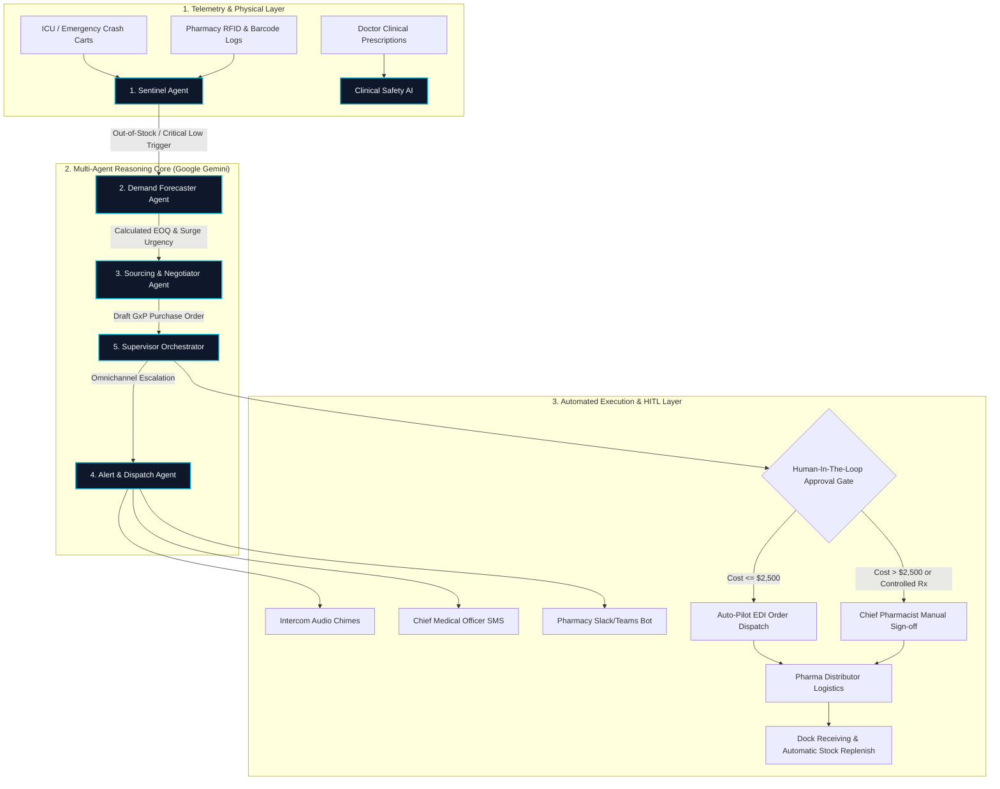

# 🏥 PharmSentinel AI: Automated Out-of-Stock Alert & Autonomous Restocking Intelligence

> **Academic Subject:** Agentic AI and Automation  
> **Topic:** Automated Out-of-Stock Alert System for Critical Pharmaceuticals and Hospital Inventory  
> **LLM Engine:** Google Gemini (Gemini 1.5 Flash / 2.0 Flash / Pro) with Neural Fallback Simulation Engine

---

## 📌 1. Project Overview

**PharmSentinel AI** is an enterprise-grade, multi-agent AI system designed to solve the critical problem of medicine stockouts in healthcare institutions, emergency crash carts, intensive care units (ICUs), and hospital pharmacies.

In medicine supply chains, stockouts of life-saving drugs (e.g., *Epinephrine, Insulin Glargine, Propofol, Remdesivir, Naloxone*) directly endanger human lives. Traditional ERPs rely on static min-max rulebooks that fail during demand surges, viral outbreaks, or cold-chain logistics breakdowns.

**PharmSentinel AI** introduces a **collaborative multi-agent architecture** that autonomously observes consumption velocity, forecasts surge risk using Google Gemini LLM reasoning, evaluates certified pharma distributors, drafts compliant GxP Purchase Orders (POs), broadcasts multi-channel emergency alerts, and executes Human-in-the-Loop (HITL) or Auto-Pilot restocking workflows.

---

## 🤖 2. Multi-Agent System Architecture

PharmSentinel AI implements a specialized 5-agent collaborative network:



### Agent Roles & Specifications:

1. **🛡️ Agent 1: Clinical Inventory Sentinel (Watcher / Monitor Agent)**
   - **Role:** Real-time telemetry scanner.
   - **Metrics:** Computes consumption velocity ($D_t$ units/hr), Safety Stock ($SS$), and Time-to-Critical-Depletion ($T_{\text{runout}}$).
   - **Triggers:** Flags `HEALTHY`, `LOW`, `CRITICAL_LOW`, and `OUT_OF_STOCK` states.

2. **🧠 Agent 2: Epidemiological & Demand Forecaster (Gemini AI Agent)**
   - **Role:** LLM-powered dynamic demand estimation.
   - **Reasoning:** Ingests local hospital context, seasonal disease transmission patterns, lead time variance, and cold-chain constraints.
   - **Outputs:** Dynamic Economic Order Quantity (EOQ), Runout Hours, and Urgency Rating (`STANDARD`, `EXPEDITED`, `IMMEDIATE_EMERGENCY`).

3. **🤝 Agent 3: Autonomous Sourcing & Pharma Supplier Negotiator (Gemini AI Agent)**
   - **Role:** Distributor selection, SLA negotiation, and PO generation.
   - **Evaluation:** Evaluates certified pharma suppliers against Cold-Chain capability (2-8°C refrigerated couriers), delivery SLAs (3-hour emergency vs 24-hour standard), and volume discount tiers (5% - 22%).
   - **Outputs:** Formally structured GxP Purchase Order with Certificate of Analysis (CoA) tags.

4. **⚡ Agent 4: Multi-Channel Alert & Dispatch Automation Agent**
   - **Role:** Immediate omnichannel notification broadcast.
   - **Channels:** Hospital Intercom Audio Alarm, Chief Medical Officer (CMO) SMS, Pharmacy Slack/Teams Webhook Bot, and ERP Audit Log.

5. **👑 Agent 5: Autonomous Supervisor & HITL Orchestrator**
   - **Role:** Workflow master, state machine governor, and policy enforcer.
   - **HITL Governance:** Automatically approves orders $\le \$2,500$ on Auto-Pilot mode, or escalates high-value / controlled substances (e.g. Propofol, Naloxone) for Chief Pharmacist digital signature.
   - **Memory:** Captures full ReAct (Thought-Action-Observation) trace logs.

---

## 💡 3. Key Features

- ✏️ **Interactive Stock Management & Real-Time Adjustments:**
  - **Inline Quick Steppers:** Directly consume (`-1`, `-5`) or add stock (`+1`, `+5`) on any medicine card.
  - **Comprehensive Stock Editor Modal:** Set exact stock levels, input custom additions/deductions, specify clinical audit reasons, and test stockout scenarios.
  - **➕ Add New Medicine SKU:** Register brand-new hospital drugs with dosage forms, burn rates, thresholds, cold-chain tags, and supplier assignments.
  - **💾 Persistent Inventory Storage:** All manual adjustments and registered SKUs persist in `localStorage` across browser refreshes, with a 1-click **🔄 Reset to Hospital Default** button.
- ✨ **Google Gemini 1.5/2.0 API Integration:** Direct LLM reasoning with prompt engineering and structured JSON outputs.
- 🔄 **Intelligent Neural Simulation Fallback:** Works 100% reliably out-of-the-box even without an API key or offline.
- 📊 **Executive Command Center:** Real-time KPI cards, stock status filters, depletion progress bars, and cold-chain badges.
- 🔍 **Real-Time ReAct Thought Trace Viewer:** Live stream showing each agent's internal monologue, action parameters, latency, and observations.
- 📦 **Autonomous PO & Sourcing Hub:** Compare distributor quotes, toggle Auto-Pilot mode, approve/reject orders, and 1-click simulate dock delivery.
- 🏥 **Clinical Prescription Safety AI:** Enter doctor prescriptions in natural language to test stock availability, detect stockouts, and recommend therapeutic alternatives.
- 🔔 **Synthesized Web Audio Alerts:** Web Audio API sound generator producing realistic hospital telemetry clicks, warning tones, and emergency chimes.
- 💾 **Audit & Export Tools:** Download agent thought traces in JSON / CSV and print formal GxP purchase orders.

---

## 🚀 4. How to Run

### Option A: Direct Browser Launch (Recommended - Zero Installation)
1. Double click [`start_server.bat`](file:///c:/Users/jayan/OneDrive/Desktop/Flexi/start_server.bat) OR open [`index.html`](file:///c:/Users/jayan/OneDrive/Desktop/Flexi/index.html) directly in any modern browser (Google Chrome, Microsoft Edge, Firefox).

### Option B: Local PowerShell HTTP Server
1. Open PowerShell in this folder and run:
   ```powershell
   powershell -ExecutionPolicy Bypass -File .\start_server.ps1
   ```
2. Navigate to `http://localhost:8080` in your web browser.

---

## 🔑 5. Adding Your Google Gemini API Key

1. Open the application in your browser.
2. Click the **✨ Gemini Settings** button in the top navigation bar.
3. Paste your Google Gemini API key (from [Google AI Studio](https://aistudio.google.com/)).
4. Select your preferred model (`Gemini 1.5 Flash`, `Gemini 2.0 Flash`, or `Gemini 1.5 Pro`).
5. Click **🧪 Test Connection** and then **💾 Save Configuration**.

*(Note: If you do not have an API key, the system automatically uses its built-in intelligent domain logic so you can present and demo the project completely).*

---

## 📂 6. Repository File Structure

```
PharmSentinel-AI/
├── index.html                     # Main Web Application & Dashboard
├── start_server.bat               # Windows 1-Click Launch Script
├── start_server.ps1               # Lightweight PowerShell HTTP Server
├── README.md                      # Project Guide & Documentation
├── PROJECT_REPORT.md              # Complete Academic Submission Report
├── PRESENTATION_GUIDE.md          # Viva & Demonstration Cheatsheet
├── css/
│   └── style.css                  # Cyber-Medical Glassmorphism Styling
└── js/
    ├── app.js                     # UI Controller & Tab Router
    ├── gemini-service.js          # Gemini LLM Client & Fallback Engine
    ├── data/
    │   ├── medicines-database.js  # 12 Life-Saving Clinical Medicines
    │   └── suppliers-database.js  # Certified Pharma Distributors & SLAs
    ├── agents/
    │   ├── inventory-sentinel-agent.js  # Agent 1: Telemetry Watcher
    │   ├── demand-forecaster-agent.js   # Agent 2: Gemini Forecaster
    │   ├── sourcing-negotiator-agent.js # Agent 3: Gemini Sourcing & PO
    │   ├── alert-dispatch-agent.js      # Agent 4: Omnichannel Alerts
    │   └── supervisor-orchestrator.js   # Agent 5: Master Orchestrator
    └── utils/
        ├── audio-alerts.js        # Web Audio API Sound Synthesizer
        └── export-utils.js        # JSON, CSV & Printable PO Generator
```

---

## 🎓 7. Academic Assessment Alignment

This project specifically demonstrates:
- **Agentic Architectures:** Multi-agent collaboration, state machines, ReAct loops (Reasoning + Acting).
- **Automation:** Event-driven triggers, background telemetry tickers, automated GxP PO drafting, and auto-pilot execution.
- **Human-in-the-Loop (HITL):** Risk-based governance thresholds and controlled substance safety sign-offs.
- **LLM Reasoning:** Structured JSON schema enforcement, domain prompt engineering, and clinical decision support.
